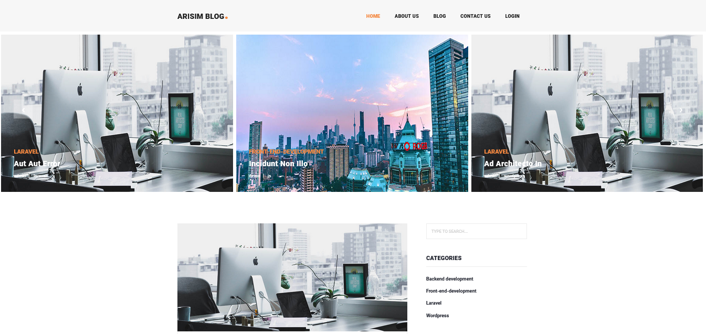
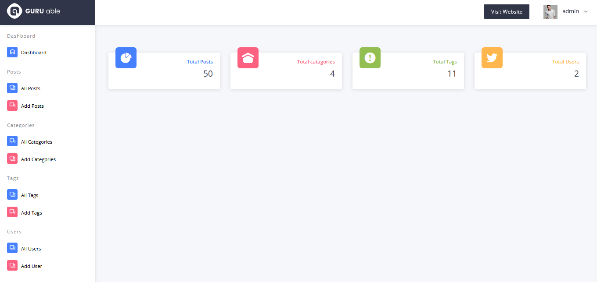

# Blog Php mysql
The PHP MySQL project is a web application that includes three main functions: category, post, and tag. The category function allows users to organize posts into specific categories, making it easier for visitors to search for relevant content. Meanwhile, the post function enables users to create and publish articles, which can be displayed on the website. Lastly, the tag function adds descriptive keywords to posts, making them accessible to users who are interested in specific topics. Together, these features create a dynamic web platform that caters to users' diverse interests and needs.

#Frontend View



#Backend View



## Run Locally

Clone the project

```bash
  git clone ariful305/Blog---php---Mysql
```

Go to the project directory

```bash
  cd Blog---php---Mysql
  Start apache and mysql server
```

```bash
  Import the database
```

## Login in credential 
  


```bash
 ** For Admin
  Username : admin
  password : 123456789
  
 ** For Editor
  Username : editor
  password : 123456789

```


## Tech Stack

**Client:** Bootstrap,php,mysql

**Server:** Apache


 
